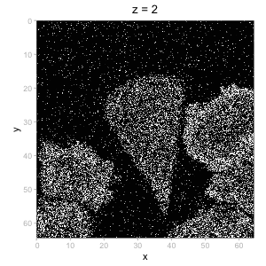
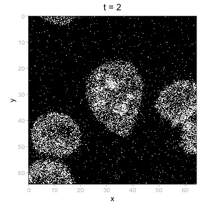

---
author:
  - name: Helena L Crowell
    affiliation: CNAG, Barcelona, Spain
date: "`r format(Sys.Date(), '%B %d, %Y')`"
---

## preamble

### dependencies

```{r load-libs, message=FALSE, warning=FALSE}
library(ggplot2)
library(patchwork)
library(spatialdataR)
library(SpatialData.plot)
```

```{r load-data}
zs <- "5514375.zarr"
lb <- file.path(zs, "labels")
(i <- readImage(zs) |> addCT(name="foo"))

# label includes a superfluous 'c'hannel dimesions
# that currently causes issues with 'plotLabel()';
# we drop it here in a not-too-pretty way
l <- readLabel(file.path(lb, "Cell")) |> addCT(name="foo")
l@data <- lapply(l@data, \(.) { dim(.) <- dim(.)[-2]; . })
sf <- spatialdataR:::.get_ms_scale(l)
l@meta <- SpatialDataAttrs(type="label", dim=4)
l@meta$multiscales[[1]]$datasets[[1]]$coordinateTransformations[[1]]$scale <- tail(sf, 1)

(sd <- SpatialData(
    images=list(image=i),
    labels=list(cells=l)))
```

```{r}
channels(image(sd))
```

```{r message=FALSE}
ax <- axes(image(sd), "name")
zi <- which(ax == "z")
nz <- dim(image(sd))[zi]
ps <- lapply(seq(2, nz, 2), \(z) {
    plotSpatialData() + 
        ggtitle(paste("z =", z)) +
        theme(legend.position="none") +
        plotImage(sd, z=z, t=1, c="white") +
        plotLabel(sd, z=z, t=1, a=1/3, pal="green") +
        scalebar(image(sd), len=10, xrel=0.9, yrel=0.9) 
})
```

```{r results="hide"}
png(file="z%02d.png", width=300, height=300)
for (p in ps) print(p)
dev.off()
 
system("bash -c 'magick -delay 10 $(ls *.png | sort) $(ls *.png | sort -r | tail -n +2) -loop 0 z-video.gif'")
file.remove(list.files(pattern=".png"))
```

```{r}
knitr::include_graphics("z-video.gif")
```

```{r message=FALSE}
ax <- axes(image(sd), "name")
ti <- which(ax == "t")
nt <- dim(image(sd))[ti]
ps <- lapply(seq(2, nt, 2), \(t) {
    plotSpatialData() + 
        ggtitle(paste("t =", t)) +
        theme(legend.position="none") +
        plotImage(sd, z=10, t=t, c="white") +
        plotLabel(sd, z=10, t=t, a=1/3, pal="green") +
        scalebar(image(sd), len=10, xrel=0.9, yrel=0.9) 
})
```

```{r results="hide"}
png(file="z%02d.png", width=300, height=300)
for (p in ps) print(p)
dev.off()
 
system("bash -c 'magick -delay 10 $(ls *.png | sort) $(ls *.png | sort -r | tail -n +2) -loop 0 t-video.gif'")
file.remove(list.files(pattern=".png"))
```

<div style="display:flex; justify-content:center;">
  
  
</div>

### appendix

::: {.callout-note icon=false, collapse=true}

### session

```{r sess-info}
sessionInfo()
```

:::
