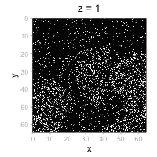

---
author:
  - name: Helena L Crowell
    affiliation: CNAG, Barcelona, Spain
date: "`r format(Sys.Date(), '%B %d, %Y')`"
---

## preamble

### dependencies

```{r load-libs, message=FALSE, warning=FALSE}
library(ggplot2)
library(patchwork)
library(spatialdataR)
library(SpatialData.plot)
```

```{r load-data}
zs <- "5514375.zarr"
lb <- file.path(zs, "labels")
(i <- readImage(zs) |> addCT(name="foo"))
(l <- readLabel(file.path(lb, "Cell")) |> addCT(name="foo"))
(m <- readLabel(file.path(lb, "Chromosomes")) |> addCT(name="foo"))
(sd <- SpatialData(
    images=list(image=i),
    labels=list(cells=l, chr=m)))
```

```{r}
channels(image(sd))
```

```{r}
ax <- axes(image(sd), "name")
zi <- which(ax == "z")
nz <- dim(image(sd))[zi]
ps <- lapply(seq_len(nz), \(z) {
    plotSpatialData() + 
        ggtitle(paste("z =", z)) +
        theme(legend.position="none") +
        plotImage(sd, z=z, t=1, c="white")
})
```

```{r results="hide"}
png(file="z%02d.png", width=200, height=200)
for (p in ps) print(p)
dev.off()
 
system("magick -delay 10 *.png video.gif")
file.remove(list.files(pattern=".png"))
```



### appendix

::: {.callout-note icon=false, collapse=true}

### session

```{r sess-info}
sessionInfo()
```

:::
